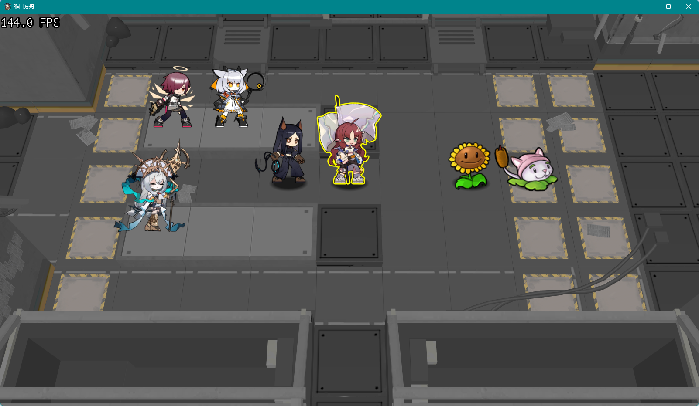

# 昨日方舟  Archknights

饭制明日方舟。

A Fan-made game of Arknights.

## 许可证 Licensing

[GNU AFFERO GENERAL PUBLIC LICENSE Version 3](https://www.gnu.org/licenses/)

昨日方舟 是 [自由软件](https://www.gnu.org/philosophy/free-sw.html)。

Arknights is a [Free/Libre Software](https://www.gnu.org/philosophy/free-sw.en.html).

## **建设中  Under Construction**

## 期望效果  Expectation

## 使用的库  Used Libraries

 - zlib License
	 - [SFML v2.6.0](https://github.com/SFML/SFML).
 - MIT License
	 - [GLM v0.9.9.8](https://github.com/g-truc/glm).
	 - [Box2D v2.4.1](https://github.com/erincatto/box2d).
 - Other licenses
	 - [GLEW v2.2.0](https://github.com/nigels-com/glew).
 - Optional 可选的
	 - [Spine Runtimes v3.8](https://github.com/EsotericSoftware/spine-runtimes).

## 缺陷 Defects

1. 
	本软件使用了 Spine Runtimes，其是[非自由](https://www.gnu.org/proprietary/proprietary.html)的。虽然它只是可选的，但仍削弱了本软件的自由性和功能。

	This software uses Spine Runtimes, which is [nonfree](https://www.gnu.org/proprietary/proprietary.en.html). Although it is optional, it still diminishes the freedom and functionality of this software.

2. 
	本软件使用了原作`明日方舟`的资源文件，其是[非自由](https://www.gnu.org/proprietary/proprietary.html)的商业产品。虽然其只是可选的，但仍削弱的本软件的自由性。

	This software uses the resource files of the original work `Arknights`, which is a [nonfree](https://www.gnu.org/proprietary/proprietary.en.html) commercial product. Although it is optional, it still diminishes the freedom of this software.

## 注意 Notice

项目包括多种构建方式。其中可能含有**可选的**依赖项。

如果使用 Spine Runtimes 构建项目，则您必须拥有**有效的 Spine 许可证**。

This project contains several configurations, and some of them have **optional** dependencies.

You must have **a valid Spine License** to build this project with the configurations that need Spine Runtimes.

[Spine Runtimes Licensing](https://github.com/EsotericSoftware/spine-runtimes#Licensing).

